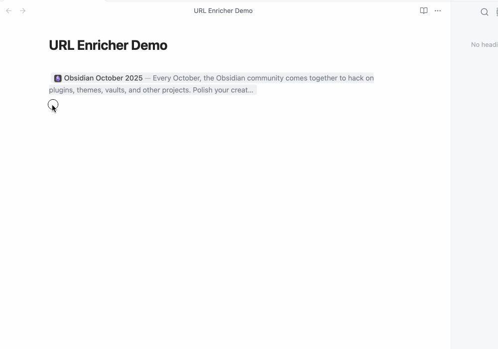

# URL Enricher

[](https://github.com/mattmarotta/obsidian-url-enricher/releases/latest)
[](LICENSE)

**Add rich, non-destructive link previews to Obsidian URLs**

See instant URL previews with title, description, and favicon — all without modifying your markdown source.



## ✨ Features at a Glance

- **100% Non-Destructive** - URLs stay as plain text in your markdown
- **Two Preview Styles** - Inline (compact) or Card (detailed with Material Design)
- **Cursor-Aware Editing** - Click URL to edit, click away to see preview
- **Automatic Metadata** - Fetches title, description, favicon automatically
- **Per-Page Configuration** - Override settings with frontmatter
- **Domain-Specific Enhancements** - Special handling for Wikipedia, Reddit, Twitter, LinkedIn, Google
- **Real-Time Updates** - Changes apply instantly

 

## 🚀 Quick Start

1. **Install** from Obsidian Community Plugins (search "URL Enricher")
2. **Paste a URL** in your note: `https://github.com`
3. **View in Live Preview mode** - see the rich preview appear
4. **Click the preview** to open the link

That's it! The plugin works automatically on all URLs in Live Preview mode.

**Customize per-page** with frontmatter:
```yaml
---
preview-style: card    # or inline
---
```

## 📖 Documentation

### For Users

- **[User Guide](docs/USER-GUIDE.md)** - Complete usage guide, features, and settings
- **[Quick Reference](docs/QUICK-REFERENCE.md)** - Cheat sheet for settings and commands
- **[Troubleshooting](docs/TROUBLESHOOTING.md)** - Common issues and solutions
- **[Advanced Features](docs/ADVANCED.md)** - Console API, debugging, performance tracking
- **[Frontmatter Configuration](docs/features/FRONTMATTER-SUPPORT.md)** - Per-page settings reference

### For Developers

- **[Contributing Guide](CONTRIBUTING.md)** - How to contribute
- **[Architecture](docs/developer/ARCHITECTURE.md)** - System design and patterns
- **[Testing](docs/developer/TESTING.md)** - Testing infrastructure
- **[Developer Guide](docs/developer/DEVELOPER-GUIDE.md)** - Development workflows

**Browse all documentation**: [docs/README.md](docs/README.md)

## ⚙️ Key Settings

Configure in **Settings → Community plugins → URL Enricher**:

- **Preview Style**: Inline (compact) or Card (detailed)
- **Include Description**: Show/hide page descriptions
- **Max Card Length**: Maximum characters for card previews (default: 300)
- **Max Inline Length**: Maximum characters for inline previews (default: 150)
- **Show Favicons**: Display site icons
- **Request Timeout**: Network timeout (default: 7000ms)

**Per-page overrides** via frontmatter - override global settings for specific notes.

See [User Guide](docs/USER-GUIDE.md) for complete settings reference and [Frontmatter Configuration](docs/features/FRONTMATTER-SUPPORT.md) for all available properties.


## 💾 Installation

### From Obsidian (Recommended)

1. Open **Settings → Community plugins → Browse**
2. Search for "URL Enricher"
3. Click **Install** → **Enable**

### Manual Installation (for Testing/Development)

1. Clone this repository into `<Vault>/.obsidian/plugins/obsidian-url-enricher/`
2. Run `npm install && npm run build`
3. Enable **URL Enricher** in **Settings → Community plugins**

## 🛠️ Development

```bash
npm install          # Install dependencies
npm run dev          # Watch mode with hot reload
npm run build        # Production build
npm test             # Run all 558 tests
npm run set-version  # Bump version across all files
```

**Testing**: 558 tests across 12 test files with comprehensive coverage of utilities, services, and business logic.

See [Developer Guide](docs/developer/DEVELOPER-GUIDE.md) and [CONTRIBUTING.md](CONTRIBUTING.md) for detailed development documentation.

## 🤝 Contributing

Contributions are welcome! Please see our [Contributing Guide](CONTRIBUTING.md) for:
- Development setup and workflows
- Coding standards (100% type-safe TypeScript)
- Testing requirements
- Git workflow and commit conventions
- Pull request process

Want to add support for a new website? See [Adding Custom Metadata Handlers](CONTRIBUTING.md#adding-custom-metadata-handlers) in the Contributing Guide.

## 📝 License

MIT - See [LICENSE](LICENSE) for details.

---

## 🔗 Links

- **[Documentation](docs/README.md)** - Complete documentation index
- **[Changelog](CHANGELOG.md)** - Version history and release notes
- **[Issues](https://github.com/mattmarotta/obsidian-url-enricher/issues)** - Report bugs or request features
- **[Discussions](https://github.com/mattmarotta/obsidian-url-enricher/discussions)** - Ask questions or share ideas

**Made with ❤️ for the Obsidian community**
