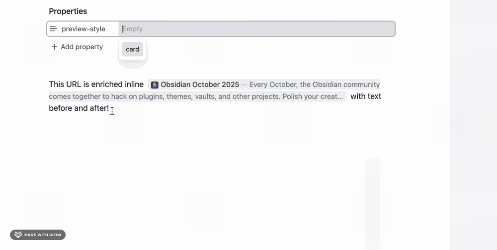

# URL Enricher

[](https://github.com/mattmarotta/obsidian-url-enricher/releases/latest)

[](LICENSE)

**Rich, non-destructive link previews for Obsidian**

Transform plain URLs into beautiful previews with title, description, and favicon — without modifying your markdown.




## Quick Start

**Plugin works only in Live Preview mode** 

Head to Settings > URL Enricher to customize global behaviour, or use frontmatter to customize per page.

**Customize per-page:**

Override global settings per-page. **Must start on line 1!**

```yaml
---
preview-style: card                   # inline | card
max-card-length: 400                  # 1-5000 (recommended: 100+)
max-inline-length: 200                # 1-5000 (recommended: 50+)
show-favicon: true                    # true | false
include-description: true             # true | false
preview-color-mode: grey              # none | grey | custom
custom-preview-color: "#4a4a4a"       # Hex color (with quotes!)
---
```

## Features

### 🎨 Two Preview Styles

**Inline** (compact): 

- Flows naturally with text
- URL completely hidden
- Perfect for reading

**Card** (detailed): 

- Material Design aesthetic
- Shows description and site name
- Great for bookmarks and research

### ✨ What You Get

- **100% Non-Destructive** - Markdown source never modified
- **Cursor-Aware** - Inline previews switch to editing mode when cursor in/around url
- **Automatic Metadata** - Fetches title, description, favicon
- **Per-Page Config** - Override settings with frontmatter
- **Domain Enhancements** - Special handling for Wikipedia, Reddit, Twitter, LinkedIn, Google
- **Real-Time Updates** - Settings apply instantly

## Supported URL Formats

```markdown
https://github.com                            # Bare URL
[custom text](https://github.com)             # Markdown link
[](https://github.com)                        # Empty link text
[[https://github.com]]                        # Wikilink (URLs only!)
```

**Not supported:** Image embeds ``, code blocks, non-HTTP protocols

## Common Issues

### Previews not showing?

- ✅ Enable **Live Preview mode** (not Source mode)
- ✅ Check URL format: `https://example.com`
- ✅ Settings → URL Enricher → Clear cache button

### Frontmatter not working?

- ⚠️ Must start on line 1 with `---`
- ⚠️ Check spelling: `preview-style` (not `previewstyle`)

### Stale or wrong previews?

- Go to **Settings → URL Enricher → Clear cache**

### Performance issues?

- Disable descriptions in Settings
- Reduce description length in Settings

### Broken URL warnings (⚠️)?

Some sites block bots (403 Forbidden). Disable warnings: **Settings → URL Enricher → HTTP Error Warnings → OFF**

For more help, see [TROUBLESHOOTING.md](TROUBLESHOOTING.md).

## Domain Enhancements

Special handling for popular sites:

- **Wikipedia** - Fetches article intros, shows "WIKIPEDIA" as site name
- **Reddit** - Format: `r/Subreddit — Title`, extracts post content
- **Twitter/X** - Fetches tweets via oEmbed, shows `@username`
- **Google Search** - Extracts query: "Google Search — your query"
- **LinkedIn** - Cleans hashtags and comment counts from titles

## Privacy & Network Usage

This plugin makes network requests to provide rich previews:

- **Page Metadata**: Fetches HTML from URLs you include in your notes to extract titles, descriptions, and favicons
- **Wikipedia API**: For Wikipedia links, queries the Wikipedia API to fetch article summaries
- **Twitter oEmbed API**: For Twitter/X links, uses Twitter's public oEmbed endpoint to fetch tweet content
- **Google Favicon Service**: Requests high-resolution favicons from Google's public service for better display quality

**Privacy:**
- ✅ No telemetry or analytics
- ✅ No user data collection
- ✅ All network requests are for fetching public web content you've linked to
- ✅ All data cached locally in your vault's plugin folder
- ✅ You control what URLs are processed

## Development

```bash
npm install                 # Install dependencies
npm run dev                 # Watch mode
npm run build               # Production build
npm test                    # Run tests (558 tests)
```

See [CONTRIBUTING.md](CONTRIBUTING.md) for detailed development guide.

## Contributing

Contributions welcome! See [CONTRIBUTING.md](CONTRIBUTING.md) for:

- Development setup
- Code standards (100% type-safe TypeScript)
- Release process
- Common gotchas

## License

MIT - See [LICENSE](LICENSE)

---

**Made with ❤️ for the Obsidian community**

- [Troubleshooting](TROUBLESHOOTING.md) - Common issues
- [Changelog](CHANGELOG.md) - Version history
- [Issues](https://github.com/mattmarotta/obsidian-url-enricher/issues) - Report bugs
- [Discussions](https://github.com/mattmarotta/obsidian-url-enricher/discussions) - Ask questions