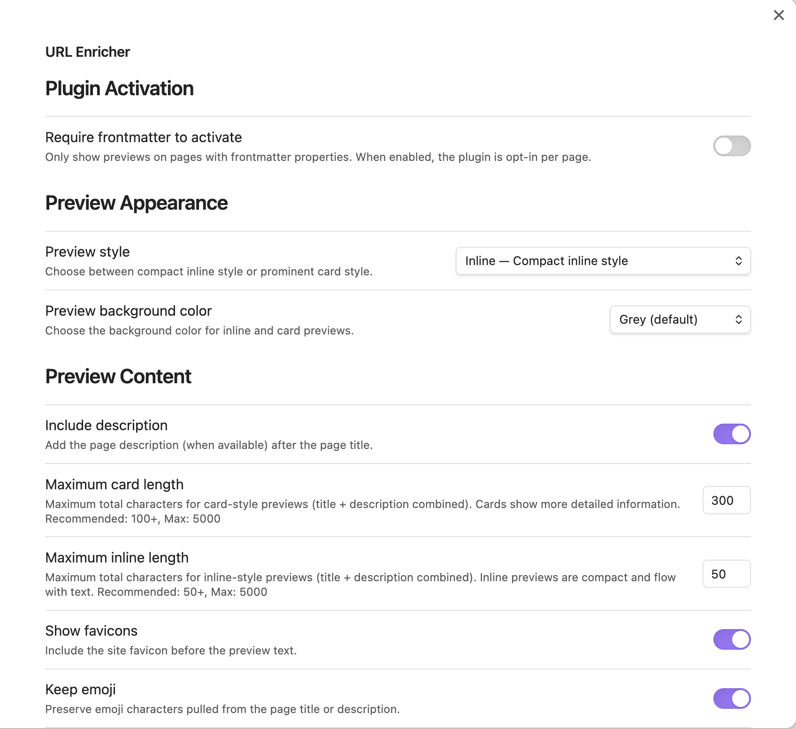
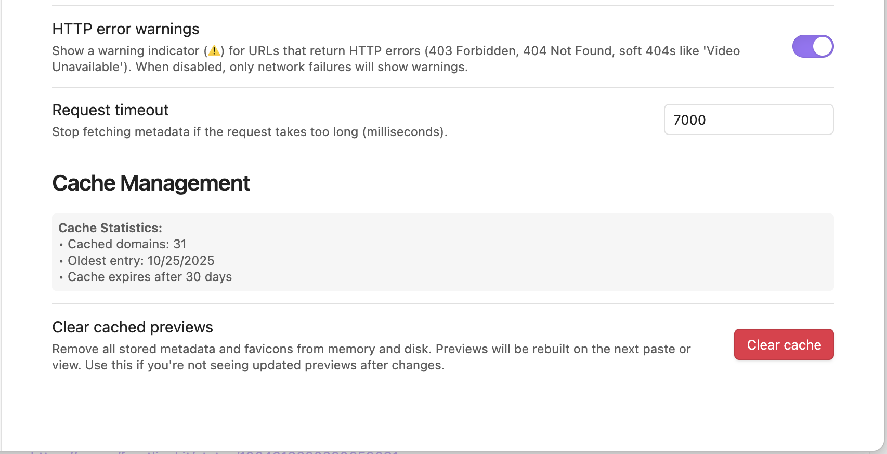

# URL Enricher User Guide

Complete guide to using the URL Enricher plugin for Obsidian.

## Table of Contents

- [Introduction](#introduction)
- [Preview Styles](#preview-styles)
- [Supported URL Formats](#supported-url-formats)
- [Features in Detail](#features-in-detail)
- [Settings Reference](#settings-reference)
- [Card Design](#card-design)
- [Domain-Specific Enhancements](#domain-specific-enhancements)
- [Privacy and Network Usage](#privacy-and-network-usage)
- [Tips and Tricks](#tips-and-tricks)

## Introduction

URL Enricher adds rich, non-destructive link previews for URLs in Obsidian. Your markdown source stays unchanged while URLs are enhanced with metadata previews in Live Preview mode.

When you have a bare URL in your notes like `https://trello.com`, the plugin automatically fetches the page title, description, and favicon, displaying them as an inline preview or prominent card right in your editor — all without modifying your source markdown.

**Key Principle**: The plugin is **completely non-destructive**. Your markdown files remain unchanged, and all previews are rendered dynamically only in Live Preview mode.

## Preview Styles

URL Enricher offers two distinct preview styles to match your workflow:

### Inline Style (Compact)


The inline style provides a compact, subtle preview that flows naturally with your text:

- **Appearance**: Favicon + Title in a compact bubble
- **URL Display**: URL is completely hidden, replaced by the preview
- **Best For**: Notes with many links, reading-focused documents, minimizing visual clutter
- **Behavior**: Flows inline with text, can wrap across lines

**Example**: `https://github.com` → 🎨 **[GitHub favicon] GitHub: Let's build from here**

### Card Style (Detailed)


The card style provides a prominent, detailed preview with Material Design aesthetics:

- **Appearance**: Large card with favicon, title, description, and site name
- **URL Display**: URL shown as small, editable text below the card
- **Best For**: Research notes, bookmarks, showcasing important links
- **Behavior**: Displayed as a card with elevation shadows

**Example**:
```
┌─────────────────────────────────────────┐
│  [Favicon] GitHub: Let's build from here│
│                                          │
│  GitHub is where people build software. │
│  More than 100 million people use...    │
│                                          │
│  ─────────────────────────────────────  │
│  GITHUB                                  │
└─────────────────────────────────────────┘
https://github.com
```

### Choosing a Style

You can set the preview style globally in settings or per-page using frontmatter:

```yaml
---
preview-style: card    # or inline
---
```

See [Settings Reference](#settings-reference) for all options.

## Supported URL Formats

The plugin automatically generates previews for URLs in these formats:

### 1. Bare URLs
Plain URLs on their own:
```
https://example.com
```

### 2. Markdown Links
Standard markdown link syntax:

**With custom text:**
```
[custom text](https://example.com)
```
Displays fetched page title in preview (custom text visible in source mode)

**Empty link text:**
```
[](https://example.com)
```
Works like a bare URL, displays fetched page title

**URL as link text:**
```
[https://example.com](https://example.com)
```
Displays fetched page title

### 3. Wikilinks with URLs
Obsidian wikilink syntax with URLs:
```
[[https://example.com]]
```

**Important**: Only URLs are supported, not Obsidian page names.
- ✅ Works: `[[https://github.com]]` (actual URL)
- ❌ Doesn't work: `[[My Page]]` (page name - normal wikilink behavior)

### What Gets Skipped

The plugin automatically skips URLs in:
- **Image embeds:** ``
- **Code blocks:** ` ```code``` `
- **Inline code:** `` `https://example.com` ``
- **Markdown tables:** URLs inside table cells (Obsidian renders tables as HTML widgets, not editable text)

**Why tables are skipped:** Obsidian renders markdown tables as HTML widgets in Live Preview mode. The plugin uses CodeMirror decorations which only apply to text in the editor layer, not content inside rendered widgets. Use URLs outside tables or in lists if you need enriched previews.

## Features in Detail

### 100% Non-Destructive

All previews are rendered dynamically in Live Preview mode only. Your markdown source files remain completely unchanged. Switch to Source mode, and you'll see the plain URLs exactly as you typed them.

**Benefits:**
- No risk of corrupting your notes
- Full compatibility with other tools
- Easy to disable the plugin without cleanup
- Git-friendly (no spurious changes)

### Cursor-Aware Previews

One of the plugin's most powerful UX features is **cursor-aware preview rendering**. Previews automatically hide when you position your cursor inside a URL, giving you instant visual feedback that you're editing the raw URL.

**How It Works:**

**When cursor is outside a URL:**
- URL shows rich preview with title, description, and favicon
- `https://github.com` → 🎨 **GitHub Preview Card**

**When cursor is inside a URL:**
- Preview instantly disappears, showing raw URL
- `https://github.com|` ← Raw URL visible, ready to edit

**When cursor moves away:**
- Preview automatically returns
- `https://github.com` → 🎨 **GitHub Preview Card**

**Why This Matters:**

1. **Prevents Accidental Edits** - You can't accidentally modify a URL without seeing it first
2. **No URL Corruption** - Clear distinction between "viewing" and "editing" states
3. **Familiar Pattern** - Works like inline code or LaTeX in many editors
4. **Uninterrupted Typing** - Type `[[https://www.amaz` without previews appearing mid-typing
5. **Easy Corrections** - Click anywhere in a preview to instantly edit the URL

This behavior applies to all URL formats: bare URLs, markdown links `[text](url)`, and wikilinks `[[url]]`.

### Automatic Metadata Fetching

The plugin automatically fetches rich metadata for every URL:

- **Title** - Page title from Open Graph tags or `<title>`
- **Description** - Page description from meta tags
- **Favicon** - Site icon at 128px resolution for crisp display
- **Site Name** - Extracted from metadata or hostname

Metadata is cached for 30 days to minimize network requests.

### Rich Metadata Display

Previews include styled formatting for better readability:

- **Hashtags** - `#tag` styled with accent color and bold
- **Mentions** - `@user` styled with accent color and bold
- **Emojis** - Preserved or stripped based on settings
- **Smart Truncation** - Text intelligently wrapped and truncated to configured lengths

### URL Error Detection

The plugin detects and flags broken URLs with a small warning indicator (⚠️). URLs with errors remain fully visible and editable—they are not replaced with previews.

**Types of errors detected:**

1. **HTTP Errors** (controllable via "HTTP Error Warnings" setting):
   - **403 Forbidden** - Site blocks automated requests
   - **404 Not Found** - Page doesn't exist
   - **500+ Server Error** - Website server error
   - **Soft 404s** - Page returns 200 OK but shows error content

2. **Network Errors** (always shown):
   - **DNS resolution failure** - Domain doesn't exist
   - **Connection timeout** - Can't reach server
   - **SSL/TLS errors** - Certificate problems
   - **No internet connection** - You're offline

See [Troubleshooting](TROUBLESHOOTING.md) for more on error handling.

### Real-Time Updates

Settings changes apply immediately without reloading:
- Change preview style → instant update
- Adjust description length → previews refresh
- Toggle favicons → immediately visible
- Change colors → instant application

## Settings Reference




Open **Settings → Community plugins → URL Enricher** to configure:

### Plugin Activation

**Require frontmatter to activate**
- When enabled, plugin only shows previews on pages with frontmatter properties
- Allows opt-in per page by adding frontmatter to specific notes
- Default: OFF (plugin works on all pages)

**Use Case**: Enable if you only want previews in certain types of notes (research, bookmarks) rather than across your entire vault.

### Preview Appearance

**Preview style**
- **Inline**: Compact, subtle inline style (default)
- **Card**: Prominent card style with more visual weight and site name footer

URL display is automatic:
- Cards show small editable URL below the card
- Inline previews hide URL entirely

**Preview background color**
- **None**: Transparent background (default)
- **Grey**: Subtle grey background
- **Custom**: Custom hex color

**Custom preview color** (when using custom mode)
- Hex color code (e.g., `#4a4a4a`)
- Only applies when "Preview background color" is set to "Custom"

### Preview Content

**Include description**
- Show/hide page description after title
- Default: ON

**Description length**
- Maximum characters for descriptions
- Range: 20-500 characters
- Default: 60
- Applies to both inline and card styles

**Show favicons**
- Display site icons before preview text
- Default: ON
- Icons fetched at 128px for crisp display

**Keep emoji**
- Preserve emoji from page titles and descriptions
- Default: OFF (strips emojis for cleaner look)

**Request timeout**
- Network timeout in milliseconds
- Range: 1000-30000ms
- Default: 7000ms
- Increase if on slow connection

**HTTP Error Warnings**
- Show ⚠️ warning for HTTP errors (403, 404, 500+)
- Default: ON
- When OFF, only network errors show warnings
- Disable if sites block bots but URLs are valid

### Cache Management

**Cache statistics**
- View current cache size, hit rate, oldest entries
- See console commands in [Advanced Features](ADVANCED.md)

**Clear cache**
- Button to clear all cached metadata and favicons
- Use when testing changes or fixing stale previews

### Per-Page Overrides

All global settings can be overridden per-page using frontmatter. See [Frontmatter Configuration](features/FRONTMATTER-SUPPORT.md) for complete reference.

Supported properties:
```yaml
---
preview-style: card              # or inline
max-card-length: 400             # 100-5000
max-inline-length: 200           # 50-5000
show-favicon: true               # or false
include-description: true        # or false
preview-color-mode: grey         # or none, custom
custom-preview-color: "#4a4a4a"  # hex color
---
```

Changes apply immediately without page reload.

## Card Design

Card-style previews follow **Material Design** principles for a clean, professional appearance.

### Visual Features

- **Clean layout** - Generous padding and spacing for readability
- **Site branding** - Favicon and site name footer
- **Visual hierarchy** - Title (1.05em, bold) → Description (0.94em, muted) → Site name (0.68em, uppercase)
- **Subtle elevation** - Soft shadows that increase on hover
- **Smooth transitions** - 200ms animations using Material's cubic-bezier easing
- **High-quality favicons** - 128px resolution for crisp display on retina screens

### Layout Structure

```
┌─────────────────────────────────────────┐
│  [Favicon] Site Title                    │  ← Header (favicon + title)
│                                          │
│  Description text with proper line       │  ← Description (muted)
│  height and spacing for readability...   │
│                                          │
│  ─────────────────────────────────────  │  ← Border separator
│  SITE NAME                               │  ← Footer (uppercase, subtle)
└─────────────────────────────────────────┘
https://example.com                          ← Editable URL below card
```

### Site Name Intelligence

Cards display site names intelligently:

- **Metadata-first** - Extracts from `og:site_name` or `application-name` meta tags
- **Smart fallback** - Parses domain if metadata unavailable (e.g., "github.com" → "GITHUB")
- **Special handling** - Wikipedia always shows "WIKIPEDIA" instead of language codes
- **Automatic branding** - Respects how sites identify themselves

## Domain-Specific Enhancements

The plugin includes specialized handlers for specific websites to provide richer, more accurate previews:

### Wikipedia

- Fetches article descriptions via Wikipedia API
- Extracts introductory section text (truncated based on max-length settings)
- Always displays "WIKIPEDIA" as site name (not language codes like "EN")
- Provides comprehensive context for encyclopedia articles

**Example**: `https://en.wikipedia.org/wiki/Obsidian`
- Title: "Obsidian"
- Description: First 3 sentences of article introduction
- Site Name: "WIKIPEDIA"

### Reddit

Custom formatting optimized for Reddit posts:

**Card view:**
- Subreddit name beside favicon
- Post title (bold)
- Content preview

**Inline view:**
- Format: `r/Subreddit — Post Title`

**Special features:**
- Separate length limits: 200 chars for cards, 100 chars for inline previews
- Fetches actual post titles and content (not just page meta tags)
- Subreddit branding displayed prominently

**Example**: `https://reddit.com/r/ObsidianMD/comments/xyz/great_plugin`
- Card: Shows `r/ObsidianMD` + "Great plugin" + post excerpt
- Inline: Shows `r/ObsidianMD — Great plugin`

### Twitter/X

Fetches tweet content via Twitter's oEmbed API (no authentication required):

**Profile URLs:**
- Shows `@username` as title (e.g., `@ThePrimeagen`)

**Tweet URLs:**
- Shows `@username` as title
- Tweet text as description

**Features:**
- Handles both `x.com` and `twitter.com` domains
- Gracefully degrades when oEmbed fails (network errors, unavailable tweets)

**Example**: `https://twitter.com/username/status/123456789`
- Title: "@username"
- Description: Tweet text content

### Google Search

Extracts search query from URL parameters:

- Displays as "Google Search — [your query]" for clearer context
- More useful than generic "Google" title

**Example**: `https://www.google.com/search?q=obsidian+plugins`
- Title: "Google Search — obsidian plugins"

### LinkedIn

Cleans LinkedIn titles for better readability:

**Problem**: LinkedIn titles start with hashtags: `#tag1 #tag2 | Author | 17 comments — Content`

**Solution**: Automatically cleans to: `Author — Content`

**Features:**
- Removes leading hashtag blocks
- Removes comment counts ("17 comments", "1 comment")
- Preserves hashtags that appear naturally in content
- Extracts author name and content preview
- Works with posts, articles, company pages, and profiles

**Example**:
- Before: `#personalbranding #careerbranding | Hina Arora | 17 comments — We are using the ChatGPT...`
- After: `Hina Arora — We are using the ChatGPT...`

### Extensible Handler System

The metadata enrichment pipeline is extensible—additional domain-specific handlers can be registered to provide custom formatting for other websites. See [Architecture](developer/ARCHITECTURE.md) and [Contributing Guide](../CONTRIBUTING.md) for details on adding custom handlers.

## Privacy and Network Usage

### How It Works

To build a preview, the plugin:

1. **Fetches the target page** - Requests the linked page directly from its server
2. **Parses HTML locally** - Extracts metadata in your browser (not sent to third parties)
3. **Fetches favicon** - Requests favicon from Google's public favicon service at 128px resolution

### What Gets Sent

- **URLs are sent directly to their target domains** - No additional third-party metadata service is used
- **Domain names to Google Favicon Service** - For consistent, high-quality icons (e.g., `reddit.com → https://www.google.com/s2/favicons?sz=128&domain=reddit.com`)

### What Gets Cached

Favicon URLs are cached on disk for 30 days to improve performance and reduce network requests. The cache stores only the mapping between domains and their favicon URLs, not the actual images or page content.

**Cache format**: `reddit.com → https://www.google.com/s2/favicons?sz=128&domain=reddit.com`

### Private Sites

If a site is private or requires authentication, the plugin will not be able to fetch metadata. You'll see either:
- A fallback preview with just the URL
- An error indicator (⚠️) if the site returns an error

### Non-Destructive Guarantee

The plugin never modifies your markdown source files. All previews are rendered dynamically in Live Preview mode only.

## Tips and Tricks

### Quick Style Switching

Use frontmatter to quickly try different preview styles for a note:

```yaml
---
preview-style: card
---
```

Change to `inline` and see the difference immediately.

### Organize Bookmarks

Use card style for bookmark notes to make links visually prominent:

```yaml
---
title: My Bookmarks
preview-style: card
max-card-length: 350
---

# Design Resources
https://dribbble.com
https://behance.net

# Development Tools
https://github.com
https://stackoverflow.com
```

### Reading Mode

Use inline style with descriptions disabled for cleaner reading:

```yaml
---
preview-style: inline
include-description: false
---
```

### Research Notes

Use card style with longer descriptions for research:

```yaml
---
preview-style: card
max-card-length: 500
include-description: true
---
```

### Quick Edit URLs

To edit a URL quickly:
1. Click on the preview
2. URL becomes visible and editable
3. Make your changes
4. Click away - preview returns automatically

### Clear Stale Previews

If a preview shows outdated information:
1. Open browser console: `Cmd+Option+I` (Mac) or `Ctrl+Shift+I` (Windows)
2. Run: `window.inlineLinkPreview.clearAllCaches()`
3. Previews will refresh with new data

### Disable for Specific Notes

To disable previews for a specific note without disabling the plugin:
1. Enable "Require frontmatter to activate" in settings
2. Don't add frontmatter to notes where you don't want previews

Or simply use Source mode for that note.

### Custom Colors per Note

Match preview colors to your note theme:

```yaml
---
preview-color-mode: custom
custom-preview-color: "#2a5a8a"  # Blue theme
---
```

### Performance Optimization

For large notes with many URLs:
- Use inline style (lighter than cards)
- Disable descriptions: `include-description: false`
- Reduce max length: `max-inline-length: 100`

See [Advanced Features](ADVANCED.md) for performance tracking and optimization.

---

**Next Steps:**
- [Troubleshooting](TROUBLESHOOTING.md) - Common issues and solutions
- [Advanced Features](ADVANCED.md) - Console API, debugging, performance
- [Quick Reference](QUICK-REFERENCE.md) - Cheat sheet for settings and commands
- [Frontmatter Configuration](features/FRONTMATTER-SUPPORT.md) - Complete frontmatter reference
